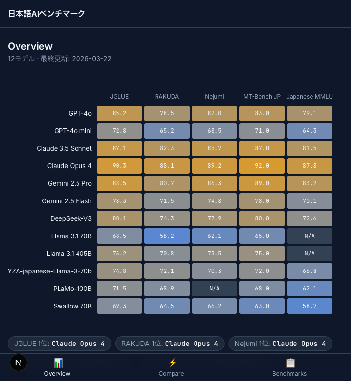
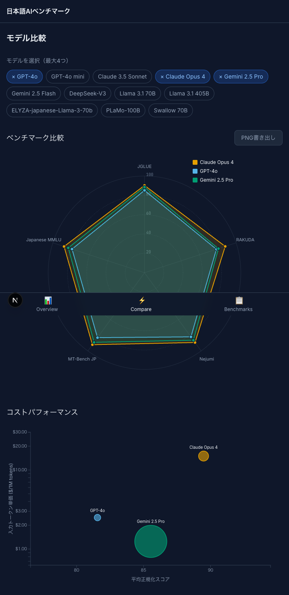

# 日本語AIベンチマーク比較ダッシュボード

日本語LLMベンチマーク（JGLUE, RAKUDA, Nejumi, MT-Bench JP, Japanese MMLU）の結果を**インタラクティブに比較**できるダッシュボード。

英語圏には [Artificial Analysis](https://artificialanalysis.ai/) のような美しい比較ツールが存在するが、日本語ベンチマークに特化したビジュアル比較ツールは存在しなかった。このプロジェクトはその空白を埋める。

## スクリーンショット

### Overview — ヒートマップ
12モデル × 5ベンチマークのスコアを色の濃淡で一覧表示。モデル名クリックで比較ページへ遷移。



### Compare — レーダーチャート & バブルチャート
最大4モデルを選択して得意/不得意を比較。バブルチャートでコストパフォーマンスを可視化。



### Benchmarks — ランキングテーブル
各ベンチマークごとのスコアランキング。

## 機能

- **ヒートマップ**: モデル × ベンチマークのスコアマトリクス。色のグラデーション（低→中→高）でスコア差が一目瞭然
- **レーダーチャート**: 2〜4モデルの得意/不得意を多角形で比較。アニメーション付き
- **バブルチャート**: X=平均スコア、Y=入力トークン単価（対数スケール）、バブルサイズ=コンテキスト長
- **モデル選択UI**: タグ形式で最大4モデルまで選択。URLクエリパラメータで状態を共有可能
- **PNG書き出し**: チャートをPNG画像として保存（SNSシェア用）
- **ダークテーマ**: データビジュアライゼーションに最適化されたダークUI
- **色覚多様性対応**: Okabe-Itoカラーパレットを採用
- **レスポンシブ**: モバイルではボトムタブバー、ヒートマップは横スクロール対応
- **欠損データ対応**: スコアがないモデル/ベンチマークは「N/A」表示、レーダーチャートでは軸をスキップ

## 技術スタック

| カテゴリ | 技術 |
|---------|------|
| フレームワーク | Next.js 15 (App Router, Static Export) |
| チャート | D3.js v7 |
| スタイリング | Tailwind CSS v4 |
| 言語 | TypeScript |
| データバリデーション | Zod |
| PNG書き出し | html-to-image |
| テスト | Vitest + @testing-library/react |
| デプロイ | Vercel (Static) |

## プロジェクト構成

```
src/
├── app/
│   ├── page.tsx              # Overview（ヒートマップ + インラインバッジ）
│   ├── compare/
│   │   ├── page.tsx          # Compare（Suspenseラッパー）
│   │   └── CompareContent.tsx # レーダー + バブル + モデル選択
│   ├── benchmarks/
│   │   └── page.tsx          # ベンチマーク別ランキング
│   ├── layout.tsx            # ルートレイアウト（ヘッダー、フォント）
│   └── globals.css           # デザイントークン、ダークテーマ
├── components/
│   ├── charts/
│   │   ├── Heatmap.tsx       # D3ヒートマップ
│   │   ├── RadarChart.tsx    # D3レーダーチャート
│   │   └── BubbleChart.tsx   # D3バブルチャート
│   ├── Header.tsx            # デスクトップナビゲーション
│   ├── MobileNav.tsx         # モバイルボトムタブバー
│   ├── ModelSelector.tsx     # モデル選択タグUI
│   └── ExportButton.tsx      # PNG書き出しボタン
├── hooks/
│   └── useD3Chart.ts         # D3共通フック（SVG管理、リサイズ、エラーハンドリング）
├── lib/
│   ├── types.ts              # Zodスキーマ + TypeScript型定義
│   ├── normalize.ts          # スコア正規化ロジック
│   ├── data.ts               # データ読込・フィルタ・ランキング計算
│   └── __tests__/            # ユニットテスト（20テスト）
└── test/
    └── setup.ts              # Vitestセットアップ

data/
└── models.json               # ベンチマークデータ（12モデル × 5ベンチマーク）
```

## セットアップ

```bash
# 依存パッケージのインストール
npm install

# 開発サーバーの起動
npm run dev

# http://localhost:3000 でアクセス
```

## コマンド一覧

| コマンド | 説明 |
|---------|------|
| `npm run dev` | 開発サーバー起動 |
| `npm run build` | プロダクションビルド（静的エクスポート） |
| `npm run start` | ビルド済みアプリの起動 |
| `npm test` | テスト実行 |
| `npm run test:watch` | テストをウォッチモードで実行 |
| `npm run lint` | ESLintによるコードチェック |

## 対象ベンチマーク

| ベンチマーク | 説明 | スケール |
|------------|------|---------|
| JGLUE | 日本語自然言語理解（JSTS, JNLI, JSQuAD等） | 0-100 |
| RAKUDA | 日本語LLM定性評価 | 0-100 |
| Nejumi | 多角的日本語LLM評価リーダーボード | 0-100 |
| MT-Bench JP | マルチターン対話品質（日本語版） | 1-10 → ×10で正規化 |
| Japanese MMLU | 日本語知識ベンチマーク | 0-100 |

## 対象モデル（v1）

GPT-4o, GPT-4o mini, Claude 3.5 Sonnet, Claude Opus 4, Gemini 2.5 Pro, Gemini 2.5 Flash, DeepSeek-V3, Llama 3.1 70B, Llama 3.1 405B, ELYZA-japanese-Llama-3-70b, PLaMo-100B, Swallow 70B

## データの更新方法

`data/models.json` を編集してベンチマークスコアを追加・更新する。ビルド時にZodスキーマで自動バリデーションされる。

```json
{
  "id": "new-model",
  "name": "New Model",
  "provider": "Provider",
  "price_per_1m_tokens": { "input": 1.0, "output": 5.0 },
  "context_length": 128000,
  "release_date": "2026-01-01",
  "benchmarks": {
    "jglue": { "score": 85.0 },
    "rakuda": null,
    "mt_bench_ja": { "score": 8.5 }
  }
}
```

- `price_per_1m_tokens`: `null` 可（オープンソースモデル等）
- `benchmarks.*`: `null` 可（未測定のベンチマーク）

## デプロイ

静的エクスポート（`output: 'export'`）のため、Vercel・GitHub Pages・Cloudflare Pages等にそのままデプロイ可能。

```bash
npm run build
# out/ ディレクトリが生成される
```

## ライセンス

MIT
